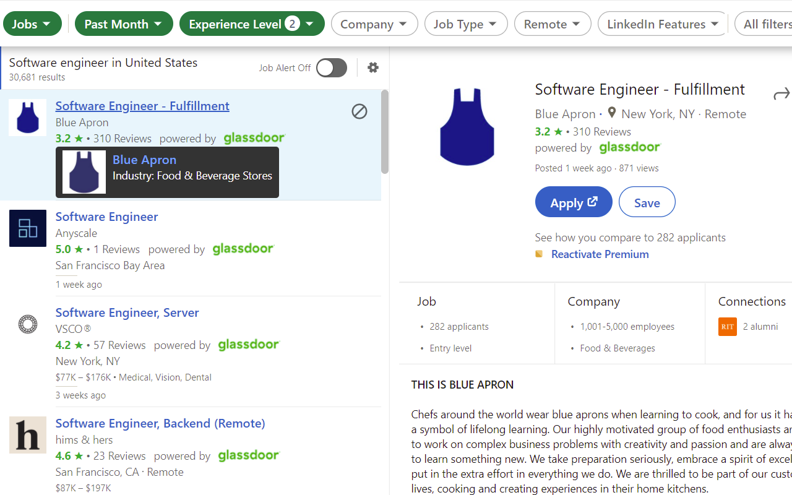
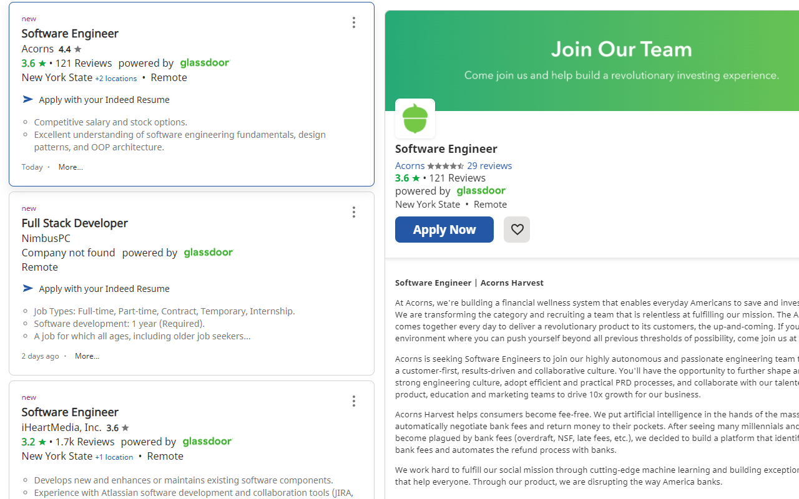
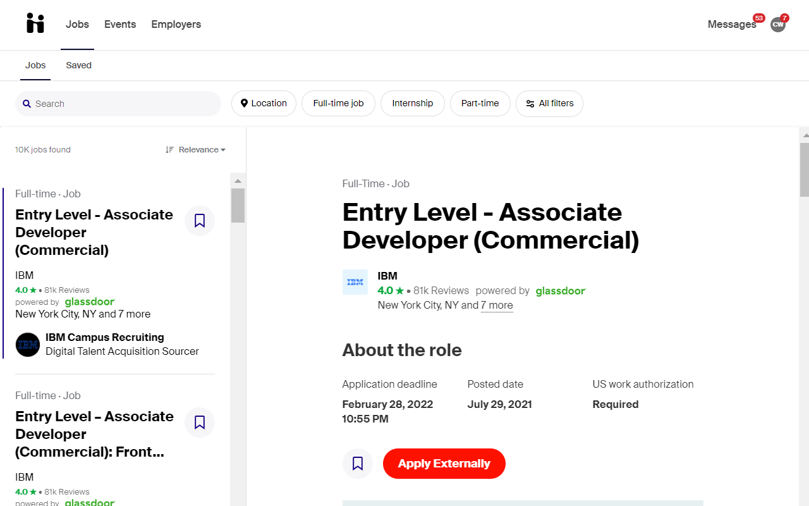
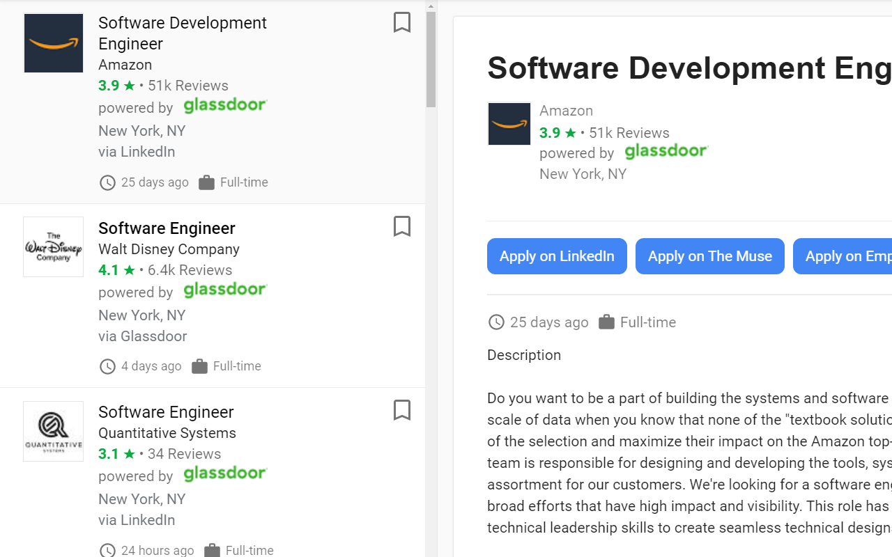

#  inDoors

> Browser extension that displays [Glassdoor] ratings for companies while browsing [LinkedIn], [Indeed], [Handshake],  and [Google for Jobs].

## Install

- [**Chrome** extension][link-chrome] [][link-chrome]
- [**Firefox** add-on][link-firefox] [][link-firefox]

## About

This extension uses an [API proxy](https://github.com/CalvinWu4/glassdoor-api-proxy) built on top of the [Glassdoor API]. Rating data is cached on the server and browser for 9 days (to reflect the [7 business days](https://help.glassdoor.com/article/Ratings-on-Glassdoor/en_US/#:~:text=It%20typically%20takes%207%20business,review.) it typically takes for a rating be updated after an employee leaves a review). Clicking on the rating opens up the reviews page for the company or the search results page if the company is not found. Mousing over the rating brings up a tooltip with the company's website and industry name.

## Notes
The fewer reviews a company has, the less likely Glassdoor will correctly find it. To improve chances of the finding the correct company, inDoors will try stripping the company name of company suffixes, generic company name endings, and locations as well as text after colons, dashes, vertical bars, parentheses, and commas (except for Inc), prioritize exact word matches in the results given by Glassdoor, and finally use the mappings in [`misdirected-names.js`](https://github.com/CalvinWu4/inDoors/blob/master/src/js/misdirected-names.js). Pull requests on that file are welcome.

## Screenshots

[link-chrome]: https://chrome.google.com/webstore/detail/indoors-glassdoor-integra/eapcedpgnlmgkigiieacngkpdjikfgci?hl=en&authuser=0 "Version published on Chrome Web Store"
[link-firefox]: https://addons.mozilla.org/en-US/firefox/addon/indoors/ "Version published on Mozilla Add-ons"

[Glassdoor]: https://www.glassdoor.com/
[LinkedIn]: https://www.linkedin.com/
[Handshake]: https://joinhandshake.com/
[Google for Jobs]: https://www.google.com/search?q=jobs+near+me&ibp=htl;jobs
[Indeed]: https://www.indeed.com/
[Glassdoor API]: http://www.glassdoor.com/api/index.htm
